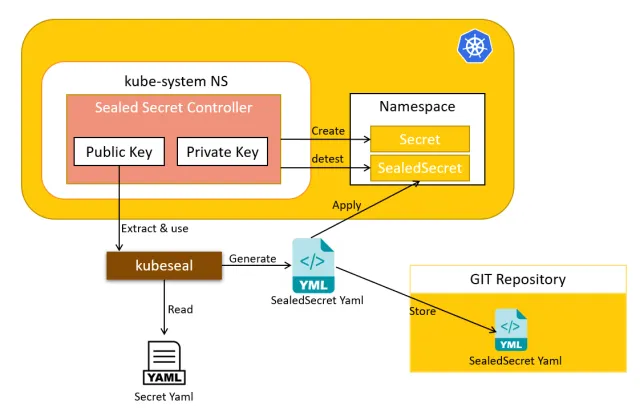

# Securing Kubernetes Secrets with Sealed Secrets

Sealed Secrets offers a robust solution for securing sensitive data in Kubernetes. The project provides a practical example for the installation and management of Sealed Secrets.

For more details, read the <a href="https://medium.com/@nmend.job/using-sealed-secrets-56276b41248d" target="_blank">full article on Medium</a>